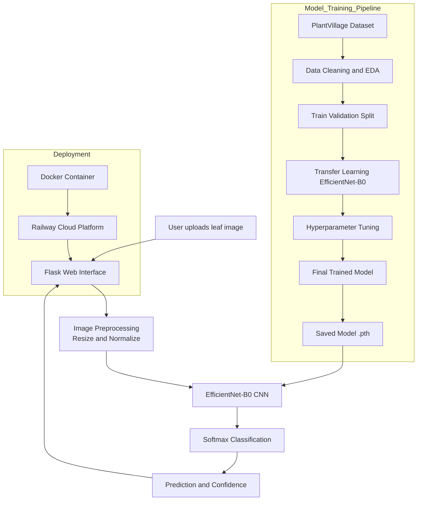
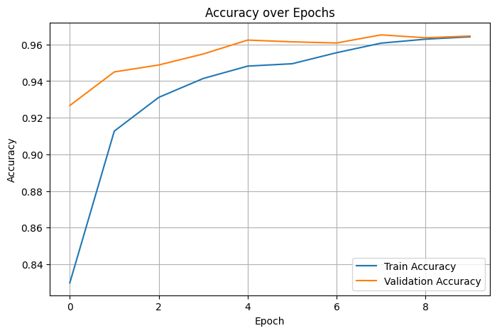
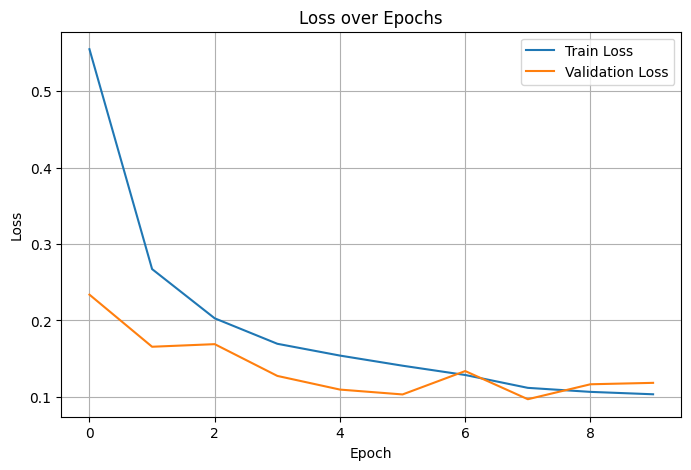
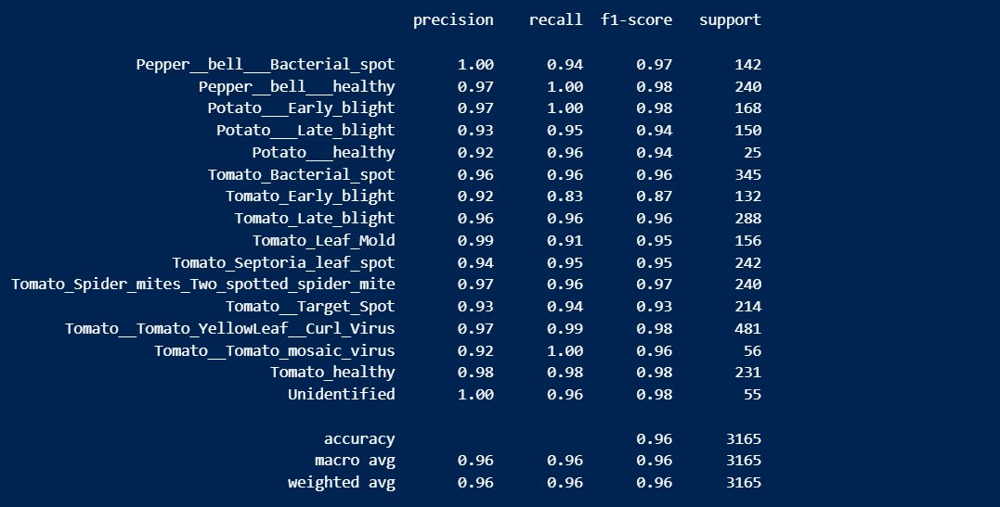
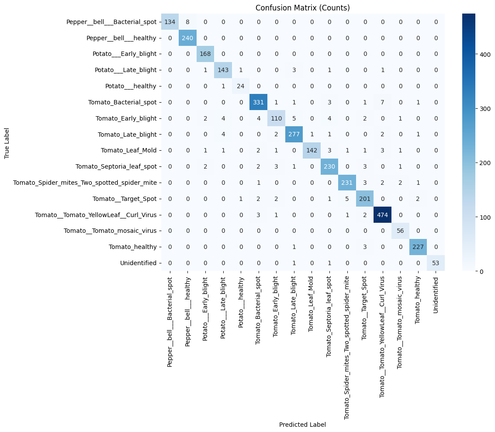

# 🌿 Plant Disease Detection using Deep Learning

## web app  
The link to the railway hosted web app of the project (more below)
https://plant-disease-detection-capstone1-production.up.railway.app/

##  Problem Description

Plant diseases significantly reduce crop yield and quality, especially in regions where access to agricultural experts is limited. Farmers often rely on visual inspection, which is error-prone and subjective.

This project aims to **automatically detect plant diseases from leaf images** using a **deep learning convolutional neural network (CNN)**. The solution allows users to upload an image of a plant leaf via a web interface and instantly receive:

- The predicted disease class (human-readable)
- The confidence score of the prediction

An additional **“Unidentified” disease class** is included to reduce false positives by capturing out-of-distribution images.

**Target users:**  
- Farmers  
- Agricultural extension workers  
- Researchers and students  

---

##  Dataset

### Primary Dataset
- **PlantVillage Dataset**
- Source: https://www.kaggle.com/datasets/emmarex/plantdisease

The dataset contains labeled leaf images across multiple crop types and disease categories.

### Additional "Unidentified" Class
To improve real-world robustness, an **Unidentified** class was manually created using unrelated plant and non-plant images.

#### How to obtain it:
1. Download the provided folder from Google Drive: https://drive.google.com/drive/folders/1lDiChOIP1ldlje4PCw7Gaw5nj5Jsnr_c?usp=sharing
2. Extract and copy the folder into: data/PlantVillage/
   
---
## System Architecture

The system follows an end-to-end machine learning pipeline, from data ingestion to cloud deployment.

---

## Demo Video 
This video contained in the google drive link shows the demonstration of how the app works 
https://drive.google.com/file/d/13Q3nVva__DmW9_JR7QKxGPPvx3-oKUSo/view?usp=sharing

---

##  Exploratory Data Analysis (EDA)

EDA was performed in `notebook.ipynb` and includes:

- Class distribution analysis
- Sample visualization per class
- Image resolution inspection
- RGB channel distribution
- Dataset imbalance observations

##  Model Training

### Architecture
- Backbone: **efficientnet_b0 (transfer learning)**
- Pretrained on ImageNet
- Final fully connected layer adapted to number of classes

### Training Strategy
Multiple experiments were conducted:
- With and without dropout
- Different learning rates
- Data augmentation vs no augmentation
- Different optimizer settings

### Hyperparameters Tuned
- Learning rate
- Dropout rate
- Number of epochs
- Batch size

### Training Metrics
#### Accuracy over epochs

#### Loss over epochs

---

## Model Evaluation

### Classification Report

### Confusion Matrix
(All values shown explicitly for clarity)

---

## Notebook

- File: `notebook.ipynb`
- Contents:
- Data loading and cleaning
- EDA and visualization
- Model experiments
- Hyperparameter tuning
- Final evaluation

---

##  Training Script

- File: `train.py`
- Responsibilities:
- Load dataset
- Train final model
- Save model checkpoint
- Save class names and metadata

Model is saved to: models/plant_disease_classifier.pth

---

##  Model Deployment

### Web Application
- Framework: **Flask**
- File: `predict.py`
- Features:
  - Image upload
  - Prediction with confidence score
  - Image preview
  - Clean class name formatting

---

## Containerization

A Dockerfile is provided to containerize the application.

### Build image
on bash

docker build -t plant-disease-app .

docker run -p 5000:5000 plant-disease-app

---

## Cloud deployment using Railway service
The application is deployed to the cloud using Railway, a modern Platform-as-a-Service (PaaS) that supports Docker-based deployments directly from GitHub repositories.

### Why Railway?

- Simple GitHub integration

- Native Dockerfile support

- Automatic builds and redeployments

- Free tier suitable for academic projects and demos

### Deployment Architecture

- Source: GitHub repository

- Build: Dockerfile-based image build

- Runtime: Flask application (Python 3.10, CPU-only PyTorch)

- Model Loading: Pretrained EfficientNet model loaded at startup

Storage: Local container filesystem (model bundled inside image)

### Deployment Steps

#### 1️ Push Project to GitHub

Ensure the repository contains:

- Dockerfile
- predict.py
- requirements.txt
- models/plant_disease_classifier.pth
- templates/
- static/

#### 2️ Create Railway Project

   Go to https://railway.app
   
   - Create a new project
   - Select Deploy from GitHub Repo
   - Choose the project repository
   
   Railway automatically:
   
   - Detects the Dockerfile
   - Builds the image
   - Runs the container

#### 3️ Environment Configuration

   The following environment variables are configured automatically or inside the Dockerfile:
   
   PORT=5000
   HOST=0.0.0.0
   PYTHONUNBUFFERED=1
   TORCH_HOME=/tmp/torch
   
   Railway automatically maps the exposed port to a public URL.

---

## Live Application

The deployed application is accessible via the Railway-generated public URL:

Live Demo: https://plant-disease-detection-capstone1-production.up.railway.app/

Users can:

  - Upload a leaf image
  - Receive predicted disease name (human-readable)
  - See confidence score

